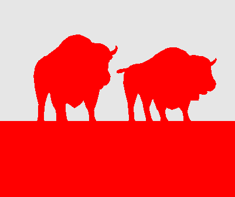
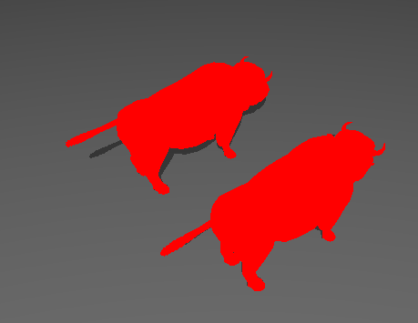
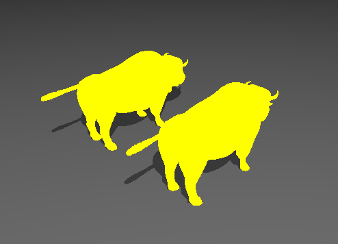

# Multiple Closest Hit Shaders - Tutorial

## Tutorial ([Setup](../docs/setup.md))

This is an extension of the Vulkan ray tracing [tutorial](https://nvpro-samples.github.io/vk_raytracing_tutorial_KHR).

The ray tracing tutorial only uses one closest hit shader, but it is also possible to have multiple closest hit shaders.
For example, this could be used to give different models different shaders, or to use a less complex shader when tracing
reflections.

## Setting up the Scene

For this example, we will load the `wuson` model and create another translated instance of it.

Then you can change the `helloVk.loadModel` calls to the following:

~~~~ C++
  // Creation of the example
  helloVk.loadModel(nvh::findFile("media/scenes/wuson.obj", defaultSearchPaths, true),
                    nvmath::translation_mat4(nvmath::vec3f(-1, 0, 0)));
  HelloVulkan::ObjInstance inst;
  inst.objIndex    = 0;
  inst.transform   = nvmath::translation_mat4(nvmath::vec3f(1, 0, 0));
  inst.transformIT = nvmath::transpose(nvmath::invert(inst.transform));
  helloVk.m_objInstance.push_back(inst);
  helloVk.loadModel(nvh::findFile("media/scenes/plane.obj", defaultSearchPaths, true));
~~~~

## Adding a new Closest Hit Shader

We will need to create a new closest hit shader (CHIT), to add it to the raytracing pipeline, and to indicate which instance will use this shader.

### `raytrace2.rchit`

We can make a very simple shader to differentiate this closest hit shader from the other one.
As an example, create a new file called `raytrace2.rchit`, and add it to Visual Studio's `shaders` filter with the other shaders.

~~~~ C++
#version 460
#extension GL_EXT_ray_tracing : require
#extension GL_GOOGLE_include_directive : enable

#include "raycommon.glsl"

layout(location = 0) rayPayloadInEXT hitPayload prd;

void main()
{
  prd.hitValue = vec3(1,0,0);
}
~~~~

### `createRtPipeline`

This new shader needs to be added to the raytracing pipeline. So, in `createRtPipeline` in `hello_vulkan.cpp`, load the new closest hit shader immediately after loading the first one.

~~~~ C++
  vk::ShaderModule chit2SM =
      nvvk::createShaderModule(m_device,  //
                               nvh::loadFile("shaders/raytrace2.rchit.spv", true, paths, true));
~~~~

Then add a new hit group group immediately after adding the first hit group:

~~~~ C++
  // Second group
  stages.push_back({{}, vk::ShaderStageFlagBits::eClosestHitKHR, chit2SM, "main"});
  hg.setClosestHitShader(static_cast<uint32_t>(stages.size() - 1));
  m_rtShaderGroups.push_back(hg);
~~~~

### `raytrace.rgen`

As a test, you can try changing the `sbtRecordOffset` parameter of the `traceRayEXT` call in `raytrace.rgen`.
If you set the offset to `1`, then all ray hits will use the new CHIT, and the raytraced output should look like the image below:

!!! Warning
    After testing this out, make sure to revert this change in `raytrace.rgen` before continuing.

### `hello_vulkan.h`

In the `ObjInstance` structure, we will add a new member variable that specifies which hit shader the instance will use:

~~~~ C++
uint32_t  hitgroup{0};     // Hit group of the instance
~~~~

This change also needs to be reflected in the `sceneDesc` structure in `wavefront.glsl`:

~~~~ C++
struct sceneDesc
{
  int  objId;
  int  txtOffset;
  mat4 transfo;
  mat4 transfoIT;
  int  hitGroup;
};
~~~~

 **Note:**
    The solution will not automatically recompile the shaders after this change to `wavefront.glsl`; instead, you will need to recompile all of the SPIR-V shaders.

### `hello_vulkan.cpp`

Finally, we need to tell the top-level acceleration structure which hit group to use for each instance. In `createTopLevelAS()` in `hello_vulkan.cpp`, change the line setting `rayInst.hitGroupId` to

~~~~ C++
rayInst.hitGroupId = m_objInstance[i].hitgroup;
~~~~

### Choosing the Hit shader

Back in `main.cpp`, after loading the scene's models, we can now have both `wuson` models use the new CHIT by adding the following:

~~~~ C++
  helloVk.m_objInstance[0].hitgroup = 1;
  helloVk.m_objInstance[1].hitgroup = 1;
~~~~

## Shader Record Data `shaderRecordKHR`

When creating the [Shader Binding Table](https://www.khronos.org/registry/vulkan/specs/1.1-extensions/html/chap33.html#shader-binding-table), see previous, each entry in the table consists of a handle referring to the shader that it invokes. We have packed all data to the size of `shaderGroupHandleSize`, but each entry could be made larger, to store data that can later be referenced by a `shaderRecordKHR` block in the shader.

This information can be used to pass extra information to a shader, for each entry in the SBT.

 **Note:**
    Since each entry in an SBT group must have the same size, each entry of the group has to have enough space to accommodate the largest element in the entire group.

The following diagram represents our current SBT, with the addition of some data to `HitGroup1`. As mentioned in the **note**, even if
`HitGroup0` doesn't have any shader record data, it still needs to have the same size as `HitGroup1`.

~~~~ Bash
+-----------+----------+ 
| RayGen    | Handle 0 | 
+-----------+----------+ 
| Miss      | Handle 1 | 
+-----------+----------+ 
| Miss      | Handle 2 | 
+-----------+----------+ 
| HitGroup0 | Handle 3 | 
|           | -Empty-  | 
+-----------+----------+ 
| HitGroup1 | Handle 4 | 
|           | Data 0   | 
+-----------+----------+ 
~~~~

## `hello_vulkan.h`

In the HelloVulkan class, we will add a structure to hold the hit group data.

### `raytrace2.rchit`

In the closest hit shader, we can retrieve the shader record using the `layout(shaderRecordEXT)` descriptor

~~~~ C++
layout(shaderRecordEXT) buffer sr_ { vec4 c; } shaderRec;
~~~~

and use this information to return the color:

~~~~ C++
void main()
{
  prd.hitValue = shaderRec.c.rgb;
}
~~~~

 **Note:**
    Adding a new shader requires to rerun CMake to added to the project compilation system.

### `main.cpp`

In `main`, after we set which hit group an instance will use, we can add the data we want to set through the shader record.

~~~~ C++
  helloVk.m_hitShaderRecord.resize(1);
  helloVk.m_hitShaderRecord[0].color = nvmath::vec4f(1, 1, 0, 0);  // Yellow
~~~~

### `HelloVulkan::createRtShaderBindingTable`

Since we are no longer compacting all handles in a continuous buffer, we need to fill the SBT as described above.

After retrieving the handles of all 5 groups (raygen, miss, miss shadow, hit0, and hit1)
using `getRayTracingShaderGroupHandlesKHR`, store the pointers to easily retrieve them.

~~~~ C++
  // Retrieve the handle pointers
  std::vector<uint8_t*> handles(groupCount);
  for(uint32_t i = 0; i < groupCount; i++)
  {
    handles[i] = &shaderHandleStorage[i * groupHandleSize];
  }
~~~~

The size of each group can be described as follows:

~~~~ C++
  // Sizes
  uint32_t rayGenSize = baseAlignment;
  uint32_t missSize   = baseAlignment;
  uint32_t hitSize =
      ROUND_UP(groupHandleSize + static_cast<int>(sizeof(HitRecordBuffer)), baseAlignment);
  uint32_t newSbtSize = rayGenSize + 2 * missSize + 2 * hitSize;
~~~~

Then write the new SBT like this, where only Hit 1 has extra data.

~~~~ C++
  std::vector<uint8_t> sbtBuffer(newSbtSize);
  {
    uint8_t* pBuffer = sbtBuffer.data();

    memcpy(pBuffer, handles[0], groupHandleSize);  // Raygen
    pBuffer += rayGenSize;
    memcpy(pBuffer, handles[1], groupHandleSize);  // Miss 0
    pBuffer += missSize;
    memcpy(pBuffer, handles[2], groupHandleSize);  // Miss 1
    pBuffer += missSize;

    uint8_t* pHitBuffer = pBuffer;
    memcpy(pHitBuffer, handles[3], groupHandleSize);  // Hit 0
    // No data
    pBuffer += hitSize;

    pHitBuffer = pBuffer;
    memcpy(pHitBuffer, handles[4], groupHandleSize);  // Hit 1
    pHitBuffer += groupHandleSize;
    memcpy(pHitBuffer, &m_hitShaderRecord[0], sizeof(HitRecordBuffer));  // Hit 1 data
    pBuffer += hitSize;
  }
~~~~

Then change the call to `m_alloc.createBuffer` to create the SBT buffer from `sbtBuffer`:

~~~~ C++
  m_rtSBTBuffer = m_alloc.createBuffer(cmdBuf, sbtBuffer, vk::BufferUsageFlagBits::eRayTracingKHR);
~~~~

### `raytrace`

Finally, since the size of the hit group is now larger than just the handle, we need to set the new value of the hit group stride in `HelloVulkan::raytrace`.

~~~~ C++
  vk::DeviceSize hitGroupSize =
      nvh::align_up(m_rtProperties.shaderGroupHandleSize + sizeof(HitRecordBuffer),
                    m_rtProperties.shaderGroupBaseAlignment);
~~~~

The stride device address will be modified like this:

~~~~ C++
  using Stride = vk::StridedDeviceAddressRegionKHR;
  std::array<Stride, 4> strideAddresses{
      Stride{sbtAddress + 0u * groupSize, groupStride, groupSize * 1},      // raygen
      Stride{sbtAddress + 1u * groupSize, groupStride, groupSize * 2},      // miss
      Stride{sbtAddress + 3u * groupSize, hitGroupSize, hitGroupSize * 3},  // hit
      Stride{0u, 0u, 0u}};                                                  // callable
~~~~

!!! Note:
    The result should now show both `wuson` models with a yellow color.

## Extending Hit

The SBT can be larger than the number of shading models, which could then be used to have one shader per instance with its own data. For some applications, instead of retrieving the material information as in the main tutorial using a storage buffer and indexing into it using the `gl_InstanceID`, it is possible to set all of the material information in the SBT.

The following modification will add another entry to the SBT with a different color per instance. The new SBT hit group (2) will use the same CHIT handle (4) as hit group 1.

~~~~ Bash
+-----------+----------+ 
| RayGen    | Handle 0 | 
+-----------+----------+ 
| Miss      | Handle 1 | 
+-----------+----------+ 
| Miss      | Handle 2 | 
+-----------+----------+ 
| HitGroup0 | Handle 3 | 
|           | -Empty-  | 
+-----------+----------+ 
| HitGroup1 | Handle 4 | 
|           | Data 0   | 
+-----------+----------+ 
| HitGroup2 | Handle 4 | 
|           | Data 1   | 
+-----------+----------+ 
~~~~

### `main.cpp`

In the description of the scene in `main`, we will tell the `wuson` models to use hit groups 1 and 2 respectively, and to have different colors.

~~~~ C++
  helloVk.m_objInstance[0].hitgroup = 1;
  helloVk.m_objInstance[1].hitgroup = 2;
  helloVk.m_hitShaderRecord.resize(2);
  helloVk.m_hitShaderRecord[0].color = nvmath::vec4f(0, 1, 0, 0);  // Green
  helloVk.m_hitShaderRecord[1].color = nvmath::vec4f(0, 1, 1, 0);  // Cyan
~~~~

### `createRtShaderBindingTable`

The size of the SBT will now account for its 3 hit groups:

~~~~ C++
 uint32_t newSbtSize = rayGenSize + 2 * missSize + 3 * hitSize;
~~~~

Finally, we need to add the new entry as well at the end of the buffer, reusing the handle of the second Hit Group and setting a different color.

~~~~ C++
    pHitBuffer = pBuffer;
    memcpy(pHitBuffer, handles[4], groupHandleSize);  // Hit 2
    pHitBuffer += groupHandleSize;
    memcpy(pHitBuffer, &m_hitShaderRecord[1], sizeof(HitRecordBuffer));  // Hit 2 data
    pBuffer += hitSize;
~~~~

**Note:**
    Adding entries like this can be error-prone and inconvenient for decent 
    scene sizes. Instead, it is recommended to wrap the storage of handles, data,
    and size per group in a SBT utility to handle this automatically.
